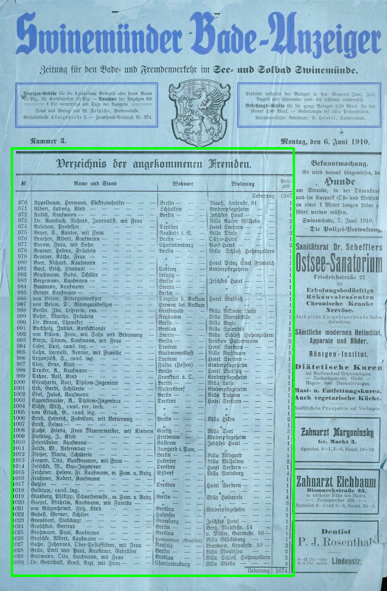
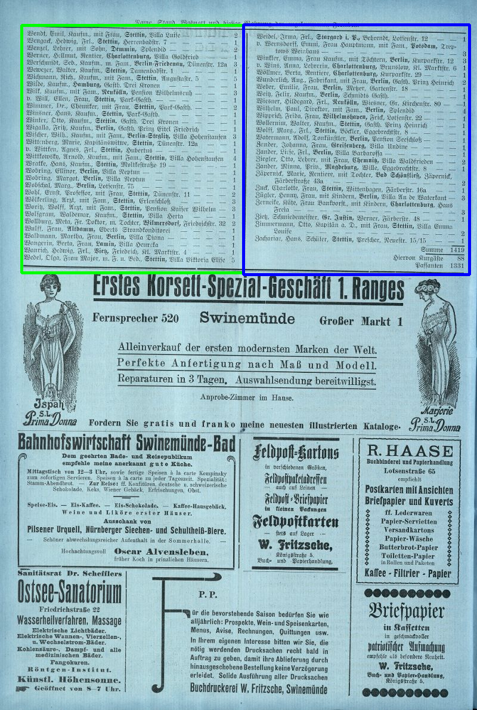
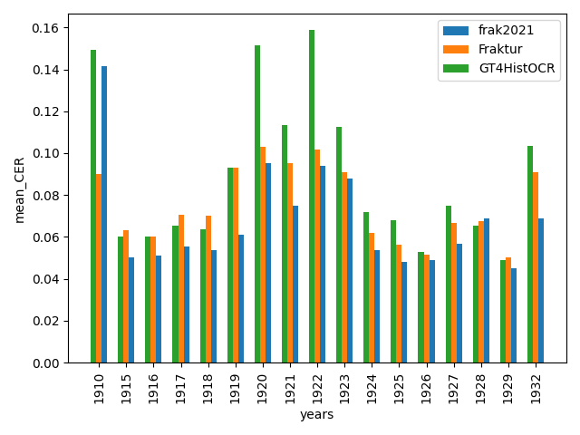
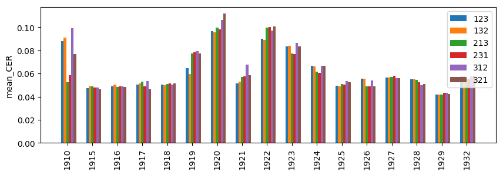
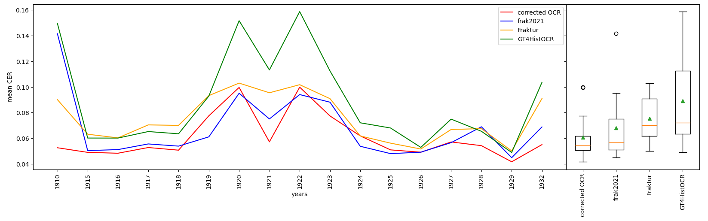
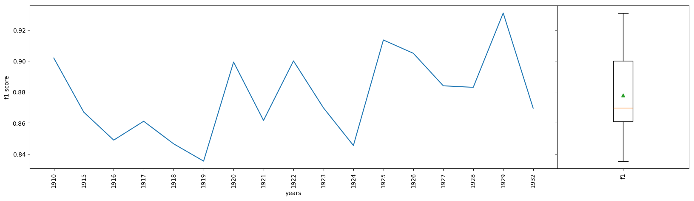
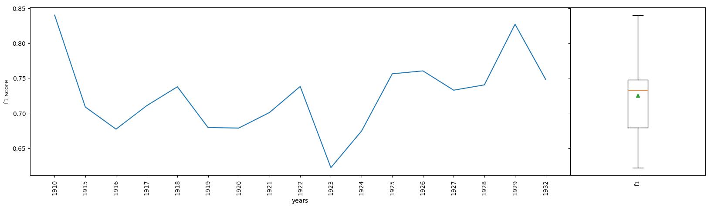

# SwineBad

This readme contains the installation guidelines and the general report.

The following steps have to be done
 - prepare data (see [Data](#Data))
 - prepare Models (see [Models](#Models))
 - install pipeline (see [Installation guideline](#installation-guideline))
 - start pipeline (see [4.3](#4-technical-details-of-the-extraction-pipeline))

## Data

- `pictures_all_low_res` contains low resolution images organized into folders per year
- `pictures_all` contains high resolution images organized into folders per year
Both directories can be downloaded with "00_download_pictures_from_library.py".

A description of the usage of both folders is provided in [4.3](#4-technical-details-of-the-extraction-pipeline). The
data within these directories has to be split in seperate years as in the following example:
- pictures_all
  - 1910
    - 00000001.jpg
    - ...
  - 1915
    - 00000005.jpg
    - ...
  - ...

## Models

The detectron2 model can be downloaded [here](https://drive.usercontent.google.com/download?id=11FgFTy0MyVUMGd00T_InEDaarB4qAlP8&export=download&confirm=t&uuid=a14a1dc3-7c68-4d39-8e27-185613da510b). The data structure needs to be placed in the detectron2_segmentation
directory such that it looks like:
- detectron2_segmentation
  - pretrained_model (here the model could be placed for further fine-tuning)
  - output_low_res
    - X152
      - All_X152
        - model_final.pth
        - ...
  - output_low_res_1910
    - X152
      - All_X152
        - model_final.pth
        - ...
  - ...
        
A description of the training can be found [here](#41-table-segmentation)

## Installation guideline:

### Installation/Running with docker

#### Installing Docker
1. Install docker on your machine ([see](https://docs.docker.com/engine/install/))
1. Start docker: `sudo service docker start`
1. Create group if not exist: `sudo groupadd docker`
1. Add USER: `sudo usermod -aG docker $USER` 
1. Log in to new group: `newgrp docker`

#### Build and Run Dockerimage

1. In order to run the python scripts which use LLMs, create an account at https://huggingface.co/, generate an access token and copy it into `hugginface_token.txt` (you need to create this file in the projects root directory prior to building the image).
1. Build the docker image: `docker build -t python_env .`
1. Start the docker: `docker run -it --gpus=all --rm --name python_env python_env`

### Installation with conda

Here are the general steps you need to do to install this project. You may not need all steps depending on what parts you want to run.

1. Create new conda environment with 'swinebad.yml' `conda env create --file=swinebad.yml`
2. Activate new conda environment 'swinebad' `conda activate swinebad`
3. Uninstall opencv-python package with: `pip uninstall opencv-python` (has been installed by dependency of labelme2coco)
4. Install opencv-python-headless with: `pip install opencv-python-headless`
5. Install detectron2 with: `python -m pip install 'git+https://github.com/facebookresearch/detectron2.git'` (see https://detectron2.readthedocs.io/en/latest/tutorials/install.html for more details)
6. To run crop_segmentation.py you have to install ImageMagick library (see https://docs.wand-py.org/en/latest/guide/install.html)
 - `sudo apt update` 
 - `sudo apt-get install libmagickwand-dev`
 - Download models and place them in the correct directory ([see](#Models))
7. To run Tesseract OCR you need to install Tesseract (see https://tesseract-ocr.github.io/tessdoc/Installation.html)
 - `sudo apt install tesseract-ocr`
 - `sudo apt install libtesseract-dev`
 - Models have to be placed in "OCR_Models". They can be downloaded with the following links: 
   - [Fraktur.traineddata](https://github.com/tesseract-ocr/tessdata_best/raw/refs/heads/main/script/Fraktur.traineddata)
   - `curl -o ./OCR_Models/Fraktur.traineddata https://github.com/tesseract-ocr/tessdata_best/raw/refs/heads/main/script/Fraktur.traineddata`
   - [Fraktur_GT4HistOCR.traineddata](https://ub-backup.bib.uni-mannheim.de/~stweil/ocrd-train/data/GT4HistOCR/tessdata_best/GT4HistOCR.traineddata)
   - `curl -o ./OCR_Models/GT4HistOCR.traineddata https://ub-backup.bib.uni-mannheim.de/~stweil/ocrd-train/data/GT4HistOCR/tessdata_best/GT4HistOCR.traineddata`
   - [frak2021.traineddata](https://ub-backup.bib.uni-mannheim.de/~stweil/tesstrain/frak2021/tessdata_best/frak2021-0.905.traineddata)
   - `curl -o ./OCR_Models/frak2021.traineddata https://ub-backup.bib.uni-mannheim.de/~stweil/tesstrain/frak2021/tessdata_best/frak2021-0.905.traineddata`
8. In order to use the LLMs, create an account at https://huggingface.co/ in order to receive a token which has to be put into a `hugginface_token.txt`.

## Project ScannedTables
### 1. Introduction

Qualitative and quantitative data analyses across all disciplines require a structured data foundation. Textual data, such as those
found in newspapers, often include supplementary tabular data to present information in an organized manner. Despite their seemingly
structured format, such tables are often considered semi- or unstructured, since access to individual elements is usually
difficult.

A notable example are historical newspapers like the Swinemünder Badeanzeiger. These can be converted into machine-readable text
formats using Optical Character Recognition (OCR). However, OCR systems primarily focus on text recognition, necessitating extensive
manual post-processing to structure and utilize the extracted data. During the “Rostocker Kulturhackathon Code Expedition”, organized
by the Universitätsbibliothek (UB) Rostock in collaboration with the UB Greifswald and the IuK-Wissenschaftsverbund der Universität Rostock,
parts of such data were processed and visualized. 

Historical newspapers are significant cultural assets and reflect the communication and social culture of past eras. Examples like the
bathing and spa gazettes of German Baltic resorts, printed from the 17th century to the first half of the 20th century, vividly
illustrate this. The UB Greifswald and UB Rostock have established themselves as centers of excellence for retro-digitization in
Mecklenburg-Vorpommern, operating the “Digitale Bibliothek Mecklenburg-Vorpommern” portal, which provides access to digitized cultural
data.

The Swinemünder Badeanzeiger (1910–1932) regularly listed the names, origins, and accommodations of prominent spa guests. The quality
of the originals is often compromised due to age. Challenges such as Gothic script, irregular layouts, and distorted text
significantly complicate OCR processing. The goal of this project was to develop a software pipeline for the automatic extraction of
tabular data from scanned historical newspapers, exemplified by the Swinemünder Badeanzeiger. The focus was not on developing new OCR
software but rather on integrating existing approaches into a tailored pipeline.

The project aimed to prepare the extracted data as both an example for evaluation and as an independent dataset, adhering to the FAIR
and CARE principles, to contribute to the Text+ collections. The open-source pipeline can be used for text extraction from other spa
or bathing gazettes.

### 2. Data Format and Scope

The Swinemünder Badeanzeiger is in the public domain. The “Digitale Bibliothek Mecklenburg-Vorpommern” contains 4,227 scans of the
Swinemünder Badeanzeiger from 1910 to 1932, with a resolution of approximately 3654x5526 pixels. The gazette was published daily
during the summer months. A central element is the “Register of Arriving Visitors”, which provides a tabular representation of all
guests. Across all issues, about 6,500 tables are available, with approximately 60 entries per table (20–60 entries). In total,
around 350,000 structured records about the guests of the Swinemünder Badeanzeiger were extracted.

### 3. Relevance to Academic Disciplines

Historical newspapers are a valuable resource for research in various disciplines, including history, cultural studies, media and
communication studies, social sciences, and related fields. Guest and spa lists, such as those in the Swinemünder Badeanzeiger, have
existed in print for German spa towns since the 17th century. It is assumed that such lists were previously kept and distributed in
handwritten form (e.g., guest lists from Bad Pyrmont).

Interest in personal and local data from the Swinemünde bathing seasons is significant for both academic research and for public interests.
Swinemünde played an important role in the 20th century due to its eventful German-Polish history. Behind the names listed in
the registers often lie remarkable personalities and families who were central to economic, social, societal, or cultural
developments. The gazette, as a medium of social communication, reflects the networks of these individuals and also documents
political, social, artistic, or religious communities. Swinemünde was not only a popular destination for the Kaiser and his entourage
but also for literati such as Theodor Fontane (who spent parts of his childhood there), Maxim Gorky, Leo Tolstoy, and the Mann
brothers.

Initial data extractions during the “Rostocker Kulturhackathon Code Expedition” revealed that a majority of spa guests came from
Berlin. Further sample analyses of 1910 editions uncovered initial personal data and even enabled the identification of descendants,
bringing the historical name registers to life and providing a starting point for further research. For example, the histories of the
Berlin factory-owning families Hetschingk and Werner offer new insights into the roles of women within families and society. Moreover,
analyses of social networks (e.g., which guests stayed in the same hotels) and changes in the spa communities over time raise new
research questions, such as the effects of growing anti-Semitism in spas, World War I, or economic crises.

A scientifically robust analysis of such newspaper data requires the application of quantitative methods that depend on improved data
quality through advanced text recognition tools. Processing these historical materials can thus create a valuable, digitally
analyzable data foundation, enabling transdisciplinary insights across the mentioned fields.

### 4. Technical Details of the Extraction Pipeline

The pipline consists of following steps:
- Segmentation: 01_crop_segmentation.py (01_crop_segmentation_multiprocessing.py for parallel processes)
  - detects the tables using low resolution images, converts the bounding box to the high resolution and crops it from
    the high resolution image
- OCR: 02_OCR_tesseract.py (02_do_OCR_multiprocessing.py for parallel processes)
  - performs OCR with three different models (Fraktur,GT4HistOCR,frak2021)
- OCR correction: 03_OCR_correction.py
  - merges the results from all models
- Strukturing: 04_structuring.py
  - structures the corrected results

#### 4.1 Table Segmentation

The first step of the pipeline involves extracting tables from the scans. The challenge lies in obtaining a complete list of
tables while minimizing the extraction of non-table content. Over the years, the table layouts varied significantly and are often
only unstructured lists.

For table segmentation, Detectron2 is utilized. Detectron2 is a powerful open-source framework for computer vision tasks like object
detection and image segmentation. It is based on PyTorch and developed by Facebook AI Research (FAIR). The framework provides tools
and pre-trained models that can be easily customized and extended.

##### 4.1.1 Pre-Trained Model

The model used in Detectron2 for table recognition is TableBank_152. It is based on a Faster R-CNN (Region-based Convolutional 
Neural Network), a proven architecture for object detection, and employs pre-trained backbone networks like ResNet152. Training was
conducted on the annotated TableBank dataset, which contains clear bounding boxes for tables. TableBank is a comprehensive dataset
specifically designed for recognizing and analyzing tables in documents. It includes over 417,000 images of tables from academic
articles and documents.

Since TableBank_152 is specialized for tables from modern documents, its applicability to historical documents like the Swinemünder
Badeanzeiger, with differing table layouts and fonts (e.g., Gothic script), requires fine-tuning to ensure accuracy.

The Model TableBank_152 can be downloaded [here](https://drive.usercontent.google.com/download?id=11FgFTy0MyVUMGd00T_InEDaarB4qAlP8&export=download&confirm=t&uuid=a14a1dc3-7c68-4d39-8e27-185613da510b).

##### 4.1.2 Data Annotation

For fine-tuning, the TableBank_152 model is trained using custom-annotated images of the Swinemünder Badeanzeiger. The annotations
were done using the free tool LabelMe, whose documentation is available [here](https://www.labelme.io/). An example of the annotated data is shown in 
Figure 4.1, where green and blue boxes indicate the annotated tables. The annotations were stored in JSON files, enabling their use
in training. The ground-truth dataset consists of 22 images per publication year, totaling 374 annotated images.

    

    
    
(a)1910: 00000001.jpg

    
    
    

    
    
(b)1915: 00000010.jpg

    

    

    

        
Abbildung 4.1: Example of annotation

##### 4.1.3 Applied Metrics

   1.  Intersection over Union (IoU)

   IoU evaluates the overlap between two bounding boxes. It is calculated by dividing the area of overlap between the bounding boxes
   by the area of their union. An IoU value of 1 indicates a perfect match between the two bounding boxes, while a value of 0 
   indicates no overlap.

   2. Precision vs. Recall

   Precision is the ratio of correctly predicted positive instances to all instances predicted as positive. A high precision value
   indicates a low rate of false positives, meaning the model is likely to be accurate when it predicts a positive class.
   Recall, also known as sensitivity, is the ratio of correctly predicted positive instances to all actual positive instances. 
   A high recall indicates that the model is effective at identifying positive instances and misses few cases.

   3. Average Precision (AP)

   Average Precision evaluates the model's performance based on precision and recall. It is commonly used to assess object detection
   systems. AP is calculated by integrating the Precision-Recall curve, which plots precision against recall.
   AP50 refers to the Average Precision under the condition that the IoU value must be at least 0.5. This means a predicted object
   is considered correctly identified only if the overlap between the predicted bounding box and the ground-truth bounding box is at
   least 50%.

##### 4.1.4 Training

For training, the data is split into 80% training data and 20% test data. This results in 299 images with 612 table segments for 
training and 75 images with 153 table segments for testing. The dataset is prepared in the COCO format, with documentation available
[here](https://cocodataset.org/#home). Training is performed using the Python script train_detectron2.py. The training process runs for a predefined number of
optimization iterations, with early stopping applied if no improvement is observed over several iterations.

Since training with high-resolution images requires excessive computational resources, the images are scaled to a width of 800 pixels
for fine-tuning, with height adjusted proportionally, as the original images vary in size. The advantage of this lower resolution is
significantly faster training, as high resolution is not essential for table recognition.

Table [4.1](#low_res) presents the results of table detection on the test dataset before and after fine-tuning. AP represents the 
mean Average Precision, calculated over multiple IoU thresholds (from 0.5 to 0.95). AP_l refers to the Average Precision for large
objects, specifically evaluating the model's performance on objects occupying a significant portion of the image or having a larger
pixel area. Since all tables in the images are relatively large, there are no values for small or medium-sized objects (AP_s and AP_m).
Fine-tuning clearly improves the performance of table detection substantially.

    <table style="margin: auto;">
    <thead>
        <tr>
            <th></th>
            <th>AP</th>
            <th>AP50</th>
            <th>AP75</th>
            <th>APs</th>
            <th>APm</th>
            <th>APl</th>
        </tr>
    </thead>
    <tbody>
        <tr>
            <td>before fine-tuning</td>
            <td>0.696</td>
            <td>1.664</td>
            <td>0.480</td>
            <td>NaN</td>
            <td>NaN</td>
            <td>0.698</td>
        </tr>
        <tr>
            <td>after fine-tuning</td>
            <td>98.281</td>
            <td>99.962</td>
            <td>98.820</td>
            <td>NaN</td>
            <td>NaN</td>
            <td>98.281</td>
        </tr>
    </tbody>
</table>

Table 4.1: Results before and after fine-tuning for all years

Due to the significant differences between the tables from 1910 and those from subsequent years, a separate fine-tuning was
performed for the 1910 tables using only the data of the year 1910. The challenge here was that a model trained on the entire
dataset occasionally identified individual columns of the 1910 tables as separate tables.

    <table style ="margin: auto;">
        <thead>
            <tr>
                <th></th>
                <th>AP</th>
                <th>AP50</th>
                <th>AP75</th>
                <th>APs</th>
                <th>APm</th>
                <th>APl</th>
            </tr>
        </thead>
        <tbody>
            <tr>
                <td>after fine-tuning</td>
                <td>92.871</td>
                <td>100.000</td>
                <td>100.000</td>
                <td>NaN</td>
                <td>NaN</td>
                <td>92.871</td>
            </tr>
        </tbody>
    </table>

Table 4.2: Results before and after fine-tuning for 1910

##### 4.1.5 Segmentation and Cropping of Tables

The trained model can now be used to detect tables. Since the model was trained on images resized to a width of 800 pixels, the
images should also be scaled accordingly during detection. After identifying the tables, they are cropped and saved as separate
images. To crop the tables from high-resolution images, the bounding boxes detected in the low-resolution images need to be adjusted
accordingly. Additionally, table detection includes several preprocessing steps, such as de-skewing the page before cropping. These
steps are carried out in the project using the Python script crop_segmentation.py.

#### 4.2 Optical Character Recognition (OCR)
##### 4.2.1 Data Annotation

To objectively evaluate text extraction and subsequent structuring, 2,178 entries across all years were manually annotated and
structured. Entire rows of tables were included, and these rows were manually categorized into different fields. The annotated data
was saved as a JSON file and split into training, validation, and test datasets. The split ratio used was 60:20:20.

The annotated data (except for the train-validation-test split) have been published and is available from Zenodo

##### 4.2.2 Data Extraction

Tesseract is used for extracting text from the tables. Tesseract is an open-source OCR engine originally developed by
Hewlett-Packard and later improved by Google. It converts text in images into machine-readable formats and supports a wide
range of languages and fonts. Detailed documentation is available [here](https://github.com/tesseract-ocr/tesseract).

Tesseract allows customization of its Page Segmentation Modes (PSM) depending on the text structure. In this project, the entire
table block is provided as input to the Tesseract engine, using PSM 6, which expects a uniform block of text as input.

Additionally, Tesseract supports configuration of OCR Engine Modes (OEM), which specify the type of OCR algorithm or combination
of algorithms the engine should use. These modes range from the legacy, rule-based OCR engine to the newer LSTM 
(Long Short-Term Memory)-based engine, which leverages neural networks. The default configuration is used in this project, 
which prioritizes the LSTM-based engine but falls back to the legacy engine if LSTM is unavailable.

Since the tables are in historical documents written in Fraktur, a model is needed that can reliably recognize this font. Instead
of training or fine-tuning a separate model, three already existing, specialized models are used, which are optimized for this font:

   - [Fraktur.traineddata](https://github.com/tesseract-ocr/tessdata_best/raw/refs/heads/main/script/Fraktur.traineddata):
        An LSTM model specifically trained for recognizing Fraktur in documents from the 19th and early 20th centuries.
        It is commonly used for historical texts but shows weaknesses with modern fonts or heavily damaged documents.

   - [Fraktur_GT4HistOCR.traineddata](https://ub-backup.bib.uni-mannheim.de/~stweil/ocrd-train/data/GT4HistOCR/tessdata_best/GT4HistOCR.traineddata):
        Developed as part of the "Ground Truth for Training OCR for Historical Documents" (GT4HistOCR) project.
        Trained on a comprehensive dataset specifically optimized for recognizing historical Fraktur.
        It performs well on documents with highly varied fonts and qualities, making it suitable for historical documents.

   - [frak2021.traineddata](https://ub-backup.bib.uni-mannheim.de/~stweil/tesstrain/frak2021/tessdata_best/frak2021-0.905.traineddata):
        An advanced LSTM model that was trained on the GT4HistOCR dataset as well as the AustrianNewspapers and the Fibeln datasets.
        Often delivers better results for texts with additional linguistic variations and a wider range of historical fonts.

All three models deliver different results and perform differently across the various years.

Since the scans originate from historical magazines, it is likely that some pages have damages or other imperfections
(e.g., water stains). This can significantly affect the OCR results.

##### 4.2.3 Evaluation

Figure 4.2 shows the results of the three OCR models on the training data. It illustrates the mean Character Error Rate (CER)
across the different years. The CER is calculated by dividing the Levenshtein distance between the ground truth and the OCR result
by the length of the ground truth. It is easy to see that the performance of the models varies significantly across the years. This
is primarily due to the varying quality of the scans, which fluctuates considerably over time. Additionally, some tables have
optical imperfections (e.g., in 1922), which is clearly reflected in the CER. When comparing the performance of the models, it
becomes apparent that no single model dominates across all years.

    

    
        
Figure 4.2: OCR result on training data

    

##### 4.2.4 OCR Correction

Since there is no model that dominates across all years and the CER is sometimes quite high, an OCR correction was performed
based on the results of the three OCR models. Therefore, a Large Language Model (LLM) is used, which receives the OCR model
results as input and aims to summarize them as error-free as possible.

An LLM is a powerful machine learning model that has been trained on large text datasets to understand, analyze, and generate
human language. The LLM used in this project is Meta's Llama 3.1 70B Instruct, a relatively large model with 70 billion parameters,
based on the Transformer architecture. To make its use feasible on the available hardware, it was quantized to 4 bits, which
somewhat limits its performance. The extent to which this affects the correction results has not been evaluated.

LLMs were primarily developed for use as chatbots. They receive a prompt as input and then output the corresponding response.
Through the system prompt, a specific role can be assigned to the chatbot, which it will adopt when interacting. In this case,
the chatbot is intended to act as an expert in correcting OCR results. The OCR results to be corrected are provided to the chatbot
via the user prompt. Analyses show that the order in which the results of the three OCR models are provided plays a role.

Figure 4.3 shows the mean CER for each year after correction for different orders of input. Here, 1 represents frak2021, 2 represents
Fraktur, and 3 represents GT4HistOCR. It is evident that different orders can lead to significant differences in performance. 
Moreover, no optimal order is apparent. Therefore, the order 213 was chosen for further processing.

    

    
        
Figure 4.3: OCR Correction for different orders evaluated on train data

    

Figure 4.4 shows the comparison of OCR correction with the separate OCR models. It is evident that the OCR correction is almost 
always below the best model. However, the performance gain compared to the best model is not very significant in most years.

    

    
        
Figure 4.4: OCR Correction for 213 evaluated on train data

    

Problems: When using LLMs for correction, several issues arise. Occasionally, unpredictable behavior occurs. For example,
the LLM might repeat a line excessively or answer a question it interprets from the prompt. In such cases, the results are 
completely unusable. Furthermore, the LLM can be confused by extremely poor results from one model, causing it to artificially
worsen the results of possibly better models during the correction process. Due to the limited performance improvement and the
additional problems, this step in the data extraction process might be omitted.

#### 4.3 Structuring

In the next step, the OCR data is structured. As before, an LLM is used, specifically the Llama 3.1 70B Instruct 4 Bit model from
Meta. The categories used here are: number, last name, first name, title, profession, social status, companion, residence, 
apartment, and number of people. The "number" category is used only used in the year 1910 and serves as a counting variable for clarity.
The system prompt tells the LLM that the chatbot is an expert in structuring data, while the OCR data is provided through the user
prompt.

The task of structuring contains several challenges. These include the inconsistent level of detail in the tables, which varies
greatly over the years. Additionally, some rows contain incomplete information. Abbreviations and ditto marks are used, adding 
further complexity. The greatest challenge is that some entries span multiple rows. These need to be merged in a further preprocessing
step before structuring, which introduces an additional source of errors.

##### 4.3.1 Applied Metric

To evaluate the structuring, the F1 metric is used. The F1 metric is a statistical measure used to assess classification models.
It combines precision and recall into a single number to evaluate a model’s performance. It is calculated as 
$f1=2 \cdot \frac{Precision \cdot Recall}{Precision + Recall}$. The F1 metric ranges from 0 to 1, with 1 meaning perfect precision 
and recall, i.e., the model correctly identifies all positive cases and makes no false positive predictions. A value of 0 means 
either precision or recall is 0, i.e., the model either identifies no positive cases or only makes false positive predictions. For
a good F1 score, it is important to minimize both false positives and false negatives.

##### 4.3.2 Structuring the Groundtruth

To evaluate the performance of the structuring, first the groundtruth data is structured. The advantage of this is that no 
additional errors from OCR mistakes or incorrect merging of multi-line entries are introduced, and the structuring can be evaluated
separately. In the evaluation, the correctness of each word's categorization is checked on a word-by-word basis.

Figure 4.5 shows the result of structuring the training data. The F1 score is plotted across different years. It can be seen that
the score fluctuates between 0.83 and 0.93 over the years. In the right section, the average F1 score across all years is shown. 
The box indicates the interquartile range, the orange line represents the median, and the green triangle shows the mean. It can be
observed that the average F1 score is approximately 0.88.

    

    
        
Figure 4.5: Structuring the groundtruth evaluated on train data

    

##### 4.3.3 Structuring of OCR Data

Finally, the end-to-end performance of the extraction pipeline is tested. For this, the OCR data is structured. It is important
to note that the two-line entries are first merged. The resulting lines are then structured as described. If an OCR error is
present in a word, it can no longer be structured correctly.

Figure 4.6 shows the result of the end-to-end evaluation on the training data. The F1 score varies between 0.62 and 0.82 over
the years. On average, a value of approximately 0.73 is achieved.

    

    
        
Figure 4.6: Structuring OCR data evaluated on train data

    

Problems:
During structuring, various issues arise. As with OCR correction, the LLM behaves unpredictably in some cases and produces
incorrect results. It not only makes mistakes in the structuring itself but also in the given output format, which complicates
further processing. Furthermore, good prompt engineering is essential but not easy to implement. This is mainly due to the
stochastic nature of LLMs. Although this can be controlled via the "temperature" parameter, doing so also worsens the expected
results.

In conclusion, it can be stated that the extraction pipeline for the "Swinemünder Badeanzeiger" works with acceptable accuracy.

### 5. OCR-D

OCR-D stands for Optical Character Recognition and Digitization. It is a framework or initiative focused on the digitization
of historical and cultural documents. The goal is to convert scanned images of texts into machine-readable formats. This process
typically involves pre- and post-processing of images, segmentation of different regions, and the use of OCR technology for text
recognition and extraction.

The OCR-D initiative aims to provide tools, workflows, and standards that facilitate the digitization process. This is intended to
enable institutions such as libraries, archives, and museums to make their collections digitally accessible. Parts of the extraction
pipeline developed in this project can also be implemented within the OCR-D framework.

#### 5.1 Segmentation in OCR-D

Table segmentation can be fully implemented within OCR-D, with some limitations. For this, the processor ocrd-detectron2-segment
can be used. The fine-tuned model can also be utilized within the OCR-D framework. To do so, the model TableBank152.pth is
replaced with the newly fine-tuned model. It is important to note that the model must retain the same name. However, it should be
noted that the processing step of transferring boxes from low-resolution images to high-resolution images is not easily
implemented or even not possible in OCR-D. Using the model directly on high-resolution images may negatively affect performance.

#### 5.2 Optical Character Recognition in OCR-D

The OCR step can also be implemented using the OCR-D framework. To use the same models, the processor ocrd-tesserocr-recognize is
used. The models can simply be placed in the designated folder for this purpose.

#### 5.3 Structuring in OCR-D

Currently, the structuring step cannot be implemented within the OCR-D framework.
