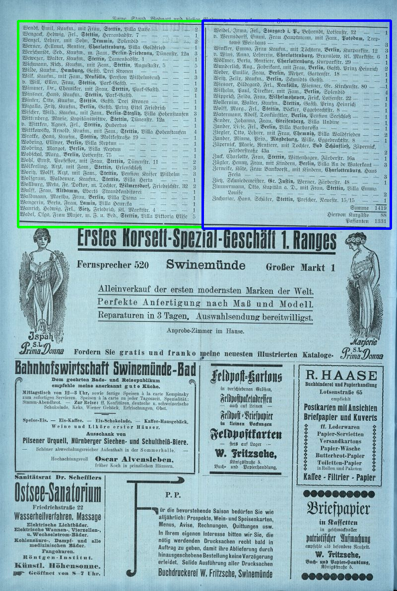
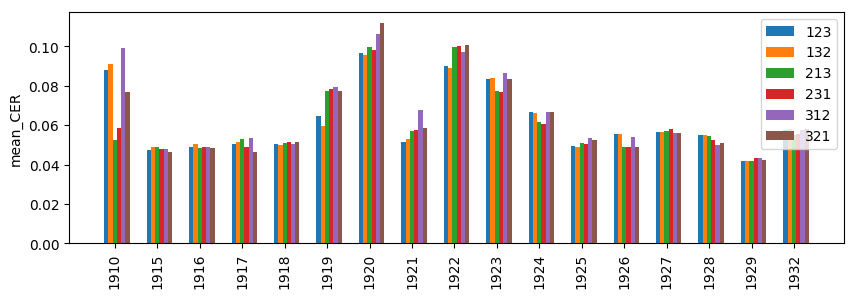
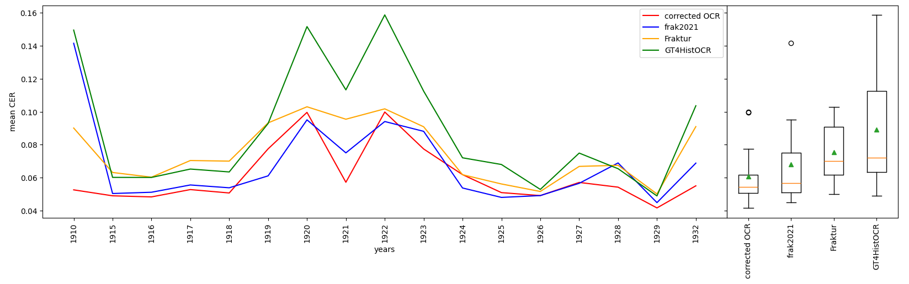
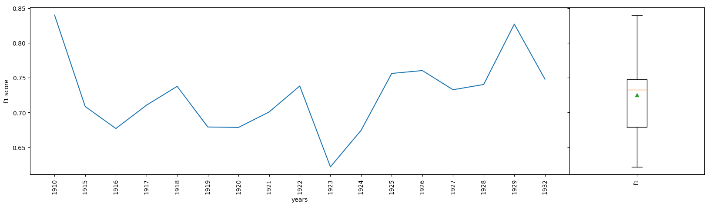

# Scanned Tables

Dieses readme beinhaltet Installationshinweise und den Projektreport.

Folgende Punkte müssen durchgeführt werden
- Daten vorbereiten (siehe [Daten](#Daten))
- Modelle vorbereiten (siehe [Modelle](#Modelle))
- Pipeline installieren (siehe [Installationshinweise](#installationshinweise))
- Pipeline starten (siehe [4.3](#4-technische-details-der-extraktions-pipline))

The following steps have to be done
 - prepare data (see [Data](#Data))
 - prepare Models (see [Models](#Models))
 - install pipeline (see [Installationshinweise](#Installationshinweise))

## Daten

- `pictures_all_low_res` beinhaltet alle Bilder in geringer Auflösung. Organisiert in Ordner pro Jahr
- `pictures_all` beinhaltet alle Bilder in hoher Auflösung. Organisiert in Ordner pro Jahr
Beide Ordner können über "00_download_pictures_from_library.py" heruntergeladen werden.

Eine Beschreibung der Nutzung der Ordner ist in [4.3](#4-technische-details-der-extraktions-pipline) zu finden. Die Daten
innerhalt dieser Ordner müssen in separate Jahre geteilt werden, wie im folgenden Beispiel:
- pictures_all
  - 1910
    - 00000001.jpg
    - ...
  - 1915
    - 00000005.jpg
    - ...
  - ...

## Modelle

Das detectron2 Model kann [hier](https://drive.usercontent.google.com/download?id=11FgFTy0MyVUMGd00T_InEDaarB4qAlP8&export=download&confirm=t&uuid=a14a1dc3-7c68-4d39-8e27-185613da510b) heruntergeladen werden. Die Datenstruktur muss innerhalt des detectron2_segmentation
ordners plaziert werden:
- detectron2_segmentation
  - pretrained_model (hier könnte das Modell zum weiteren Fine-tuning plaziert werden)
  - output_low_res
    - X152
      - All_X152
        - model_final.pth
        - ...
  - output_low_res_1910
    - X152
      - All_X152
        - model_final.pth
        - ...
  - ...
        
Eine Beschreibung vom Training kann [hier](#41-tabellen-segmentierung) gefunden werden.

## Installationshinweise:
### Installation mit docker:
1. Installiiere docker ([siehe](https://docs.docker.com/engine/install/))
2. Starte docker: `sudo service docker start`
3. Erstelle Docker Gruppe falls noch nicht existent: `sudo groupadd docker`
4. Füge USER hinzu: `sudo usermod -aG docker $USER` 
5. In neue Gruppe einloggen: `newgrp docker`
6. Erstelle docker image: `docker build -t python_env .`
7. Start docker: `docker run -it --rm --name python_env python_env`
8. Aktiviere venv: `source venv/bin/activate`
9. Um die LLMs zu nutzen, muss ein Account bei https://huggingface.co/ angelegt werden um ein Token zu erhalten. Dieser muss in `hugginface_token.txt` eingefügt werden.

### Installation with conda

Hier sind die Schritte, die nötig sind um dieses Projekt zu installieren. Abhängig, was ausgeführt werden soll, werden
nicht alle Schritte benötigt.

1. Erzeute ein neues conda environment mit 'swinebad.yml' `conda env create --file=swinebad.yml`
2. Aktiviere das conda environment 'swinebad' `conda activate swinebad`
3. Entferne opencv-python Paket mit: `pip uninstall opencv-python` (wurde automatisch installiert)
4. Installier opencv-python-headless mit: `pip install opencv-python-headless`
5. Installier detectron2 mit: `python -m pip install 'git+https://github.com/facebookresearch/detectron2.git'` (siehe https://detectron2.readthedocs.io/en/latest/tutorials/install.html for more details)
6. Um crop_segmentation.py auszuführen, muss die ImageMagick Bibliothek insalliert sein (siehe https://docs.wand-py.org/en/latest/guide/install.html)
 - `sudo apt update` 
 - `sudo apt-get install libmagickwand-dev`
 - Downloade die Modelle und packe sie an die korrekte Stelle. ([siehe](#Modelle))
7. Um Tesseract OCR auszuführen muss Tesseract installiert sein (siehe https://tesseract-ocr.github.io/tessdoc/Installation.html)
 - `sudo apt install tesseract-ocr`
 - `sudo apt install libtesseract-dev`
 - Modelle sind bereits in "OCR_Models" vorhanden. Sie können allerdings auch mit den folgenden Links heruntergeladen werden: 
   - [Fraktur.traineddata](https://github.com/tesseract-ocr/tessdata_best/raw/refs/heads/main/script/Fraktur.traineddata)
   - `sudo curl -o ./OCR_Models/Fraktur.traineddata https://github.com/tesseract-ocr/tessdata_best/raw/refs/heads/main/script/Fraktur.traineddata`
   - [Fraktur_GT4HistOCR.traineddata](https://ub-backup.bib.uni-mannheim.de/~stweil/ocrd-train/data/GT4HistOCR/tessdata_best/GT4HistOCR.traineddata)
   - `sudo curl -o ./OCR_Models/GT4HistOCR.traineddata https://ub-backup.bib.uni-mannheim.de/~stweil/ocrd-train/data/GT4HistOCR/tessdata_best/GT4HistOCR.traineddata`
   - [frak2021.traineddata](https://ub-backup.bib.uni-mannheim.de/~stweil/tesstrain/frak2021/tessdata_best/frak2021-0.905.traineddata)
   - `sudo curl -o ./OCR_Models/frak2021.traineddata https://ub-backup.bib.uni-mannheim.de/~stweil/tesstrain/frak2021/tessdata_best/frak2021-0.905.traineddata`
8. Um die LLMs zu nutzen, muss ein Account bei https://huggingface.co/ angelegt werden um ein Token zu erhalten. Dieser muss in `hugginface_token.txt` eingefügt werden.

## Projekt ScannedTables
### 1. Einleitung

Qualitative und quantitative Datenanalysen erfordern in allen Fachbereichen eine strukturierte Datenbasis. 
Textuelle Daten, wie sie beispielsweise in Zeitungen vorkommen, enthalten oft ergänzende Tabellendaten, 
um Informationen übersichtlich darzustellen. Trotz ihres scheinbar strukturierten Formats gelten solche 
Tabellen häufig als semi- oder unstrukturiert, da ein gezielter Zugriff auf einzelne Elemente meist schwierig ist.

Ein besonderes Beispiel bilden historische Zeitungen wie der „Swinemünder Badeanzeiger“. Diese können mithilfe 
von Optical Character Recognition (OCR) in maschinenlesbare Textformate umgewandelt werden. Allerdings sind 
OCR-Systeme primär auf die Erkennung von Text fokussiert, weshalb eine aufwendige manuelle Nachbearbeitung 
notwendig ist, um die extrahierten Daten zu strukturieren und nutzbar zu machen. Im Rahmen des „Rostocker 
Kulturhackathons Code Expedition“, organisiert von der Universitätsbibliothek (UB) Rostock in Kooperation mit der UB 
Greifswald und dem IuK-Wissenschaftsverbund der Universität Rostock, wurden Teile solcher Daten aufbereitet und 
visualisiert. Die Ergebnisse, einschließlich der Quelltexte, wurden auf GitHub unter ... veröffentlicht.

Historische Zeitungen sind ein bedeutendes Kulturgut und Spiegel der Kommunikations- und Sozialkultur 
vergangener Zeiten. Beispiele wie die Bade- und Kuranzeiger deutscher Ostseebäder, die vom 17. Jahrhundert bis 
in die erste Hälfte des 20. Jahrhunderts gedruckt wurden, illustrieren dies eindrücklich. Die UB Greifswald und 
die UB Rostock haben sich als Kompetenzzentren für die Retrodigitalisierung in Mecklenburg-Vorpommern etabliert 
und betreiben das Portal „Digitale Bibliothek Mecklenburg-Vorpommern“, in dem digitalisierte Kulturdaten 
bereitgestellt werden.

Der „Swinemünder Badeanzeiger“ (1910–1932) listete regelmäßig Namen, Herkunft und Unterkunft prominenter 
Kurgäste. Die Qualität der Originale ist aufgrund des Alters oft beeinträchtigt, und Herausforderungen wie die 
Frakturschrift, unregelmäßige Layouts sowie verzerrte Texte erschweren die OCR-Verarbeitung erheblich. Ziel dieses 
Projekts war die Entwicklung einer Software-Pipeline zur automatischen Extraktion von Tabellendaten 
aus gescannten historischen Zeitungen, exemplarisch am „Swinemünder Badeanzeiger“. Dabei lag der Fokus nicht 
auf der Entwicklung einer neuen OCR-Software, sondern auf der Integration bestehender Ansätze in eine angepasste 
Pipeline. 

Im Projekt sollten die gewonnenen Daten sowohl als Beispiel zur Evaluierung als auch als eigenständiger Datensatz 
aufbereitet und gemäß den FAIR- und CARE-Prinzipien veröffentlicht werden, um sie in die Text+-Sammlungen 
einzubringen. Die als Open Source bereitgestellte Pipeline kann beispielsweise für die Textextraktion weiterer 
Bade- oder Kuranzeiger verwendet werden.

### 2. Datenformat und Umfang

Der „Swinemünder Badeanzeiger“ ist urheberrechts- und damit gemeinfrei. In der „Digitalen Bibliothek 
Mecklenburg-Vorpommern“ sind 4227 Scans des „Swinemünder Badeanzeigers“ aus den Jahren 1910 bis 1932 mit einer Auflösung
von ca. 3654x5526 verfügbar. Der Anzeiger erschien während der Sommermonate täglich. Ein zentrales Element ist das 
„Verzeichnis der ankommenden Fremden“, welches eine tabellarische Darstellung aller Gäste darstellt. Insgesamt stehen
über alle Jahrgänge ungefähr 6500 Tabellen zur verfügung mit ca. 60 Einträgen (20-60). Insgesamt wurden somit ca. 350000
strukturierte Daten über die Gäste des „Swinemünder Badeanzeigers“ extrahiert.

### 3. Relevanz für Fachbereiche

Historische Zeitungen bieten eine wertvolle Quelle für Forschungen in verschiedenen Disziplinen wie Geschichte, 
Kulturwissenschaften, Medien- und Kommunikationswissenschaften, Sozialwissenschaften und verwandten Gebieten. 
Kur- und Badelisten, wie der „Swinemünder Badeanzeiger“, existieren in gedruckter Form für deutsche Kurorte bereits 
seit dem 17. Jahrhundert. Es ist anzunehmen, dass solche Listen zuvor handschriftlich geführt und verbreitet wurden 
(vgl. Kurlisten aus Bad Pyrmont).

Das Interesse an Personen- und Lokaldaten aus den Badesaisons Swinemündes ist sowohl für wissenschaftliche Forschungen
als auch für die breite Öffentlichkeit relevant. Swinemünde spielte insbesondere aufgrund seiner wechselvollen 
deutsch-polnischen Geschichte im 20. Jahrhundert eine bedeutende Rolle. Hinter den in den Listen aufgeführten 
Personennamen verbergen sich oft bemerkenswerte Persönlichkeiten und Familien, die in wirtschaftlicher, 
gesellschaftlicher, sozialer oder kulturpolitischer Hinsicht von zentraler Bedeutung waren. Der Badeanzeiger als 
soziales Kommunikationsmedium spiegelt die Netzwerke dieser Persönlichkeiten wider und dokumentiert 
darüber hinaus politische, soziale, künstlerische oder religiöse Gemeinschaften. So war Swinemünde nicht nur ein 
beliebtes Ziel des Kaisers und seiner Gefolgsleute, sondern auch von Literaten wie Theodor Fontane (der dort Teile 
seiner Kindheit verbrachte), Maxim Gorki, Leo Tolstoi und den Brüdern Mann.

Erste Datenextraktionen während des Rostocker Kulturhackathons „Code Expedition“ haben ergeben, dass ein Großteil der
Badegäste aus Berlin stammte. Weitere stichprobenartige Analysen der Ausgaben von 1910 haben erste Personendaten zutage
gefördert und sogar die Identifizierung von Nachfahren ermöglicht, was die historischen Namenstabellen lebendig wirken
lässt und einen Ausgangspunkt für weitere Forschungen bietet. Ein Beispiel ist die Geschichte der Berliner 
Fabrikbesitzerfamilien Hetschingk und Werner, die neue Einblicke in die Rolle der Frauen innerhalb der Familie und 
Gesellschaft liefert. Zudem eröffnen Analysen sozialer Netzwerke (z.B. welche Gäste gemeinsam in einem Hotel logierten) 
und die Veränderungen der Badegesellschaften im Laufe der Zeit neue Forschungsfragen, etwa zu den Auswirkungen des 
wachsenden Bäder-Antisemitismus, des Ersten Weltkriegs oder der Wirtschaftskrisen.

Eine wissenschaftlich fundierte Auswertung solcher Zeitungsdaten erfordert die Anwendung quantitativer Methoden, die 
auf eine verbesserte Datenqualität durch fortschrittliche Tools zur Texterkennung angewiesen sind. Die Aufbereitung 
dieser historischen Inhalte kann somit eine wertvolle, digital analysierbare Datenbasis schaffen, die transdisziplinäre 
Erkenntnisse in den genannten Fachbereichen ermöglicht.

### 4. Technische Details der Extraktions Pipline

Die Pipeline besteht aus folgenden steps:
- Segmentierung: 01_crop_segmentation.py (01_crop_segmentation_multiprocessing.py für parallele Prozesse)
  - Detektiert Tabellen auf Basis der Bilder mit geringer Auflösung und extrahiert diese dann aus den Bildern mit hoher Auflösung.
- OCR: 02_OCR_tesseract.py (02_do_OCR_multiprocessing.py für parallele Prozesse)
  - Führt die OCR-Erkennung mit 3 verschiedenen Modellen aus (Fraktur,GT4HistOCR,frak2021)
- OCR-Korrektur: 03_OCR_correction.py
  - Korrigiert OCR-Ergebnisse auf Basis der 3 Modelle
- Strukturierung: 04_structuring.py
  - Strukturiert die korrigierten Ergebnisse

#### 4.1 Tabellen Segmentierung

Im ersten Schritt der Pipeline müssen die Tabellen aus den Scans extrahiert werden. Die Herausforderung besteht darin,
eine möglichst vollständige Liste der Tabellen zu erhalten und möglichst wenig Inhalt zu extrahieren, der zu keiner
Tabelle gehört. Dabei haben die Tabellen über die Jahre unterschiedliche Tabellenlayouts und bestehen zum großen Teil
lediglich aus unstrukturierten Listen.

Für die Tabellensegmentierung wird Detectron2 verwendet. Detectron2 ist ein leistungsstarkes Open-Source-Framework für
Computer Vision, das speziell für Aufgaben wie Objekt- und Bildsegmentierung entwickelt wurde. Es basiert auf PyTorch
und wurde von Facebook AI Research (FAIR) entwickelt. Es bietet Werkzeuge und vortrainierte Modelle, die leicht 
angepasst und erweitert werden können. 

##### 4.1.1 Vortrainiertes Modell

Das Modell, welches in Detectron2 für die Tabellenerkennung verwendet wird, ist „TableBank_152“. Es
Modell basiert auf einem Faster R-CNN (Region-based Convolutional Neural Network), einer bewährten Architektur für die 
Objekterkennung, und nutzt vortrainierte Backbone-Netzwerke wie ResNet152. Das Training wurde auf den annotierten
TableBank-Daten durchgeführt, die klare Begrenzungsrahmen (Bounding Boxes) für Tabellen enthalten. TableBank ist ein
umfassender Datensatz, der speziell für die Erkennung und Analyse von Tabellen in Dokumenten entwickelt wurde. Er 
enthält über 417.000 Bilder von Tabellen aus wissenschaftlichen Artikeln und Dokumenten. Da das Modell „TableBank_152“
auf Tabellen aus modernen Dokumenten spezialisiert ist und die Tabellenlayouts und die Schriftarten 
(z. B. Frakturschrift) deutlich von den Trainingsdaten abweichen, ist für die Verwendung für historische Dokumente, 
wie den „Swinemünder Bade-Anzeiger“, ein Fine-Tuning erforderlich.

Das vortrainierte Modell TableBank_152 kann [hier](https://drive.usercontent.google.com/download?id=11FgFTy0MyVUMGd00T_InEDaarB4qAlP8&export=download&confirm=t&uuid=a14a1dc3-7c68-4d39-8e27-185613da510b) heruntergeladen werden.

##### 4.1.2 Datenannotation
Für das Fine-Tuning wird das Modell „TableBank_152“ mit eigens annotierten Bildern des 
„Swinemünder Badeanzeigers“ trainiert. Die Annotationen wurden mit dem kostenlosen Tool „labelme“ durchgeführt. 
Die Dokumentation dazu ist [hier](https://www.labelme.io/) verfügbar. Ein Beispiel für die annotierten Daten ist in Abbildung [4.1](#image_1915_first)
dargestellt, wobei die grünen und blauen Kästchen den annotierten Tabellen entsprechen. Die Annotationen wurden in 
einer .json-Datei gespeichert, sodass sie für das Training verwendet werden konnten. Der Ground-Truth-Datensatz umfasst
umfasst 22 Bilder aus jedem Jahrgang und enthält somit 374 annotierte Bilder.

    

    
    
(a)1910: 00000001.jpg

    
    
    

    
    
(b)1915: 00000010.jpg

    

    

    

        
Abbildung 4.1: Example of annotation

##### 4.1.3 Verwendete Metriken

1.  Intersection over Union (IoU)

IoU bewertet die Überlappung zwischen zwei Bounding Boxes. Der IoU wird berechnet, indem die Fläche der Überlappung 
zwischen den beiden Bounding Boxes durch die Fläche ihrer Vereinigung geteilt wird. Ein IoU-Wert von 1 bedeutet, dass
die beiden Bounding Boxes perfekt übereinstimmen, während ein Wert von 0 bedeutet, dass sie sich nicht überlappen.

2. Precision vs. Recall

Precision ist das Verhältnis der korrekt als positiv vorhergesagten Instanzen zu allen als positiv vorhergesagten 
Instanzen. Ein hoher Precision-Wert zeigt, dass ein Modell eine niedrige Rate an falsch-positiven 
Vorhersagen hat, was bedeutet, dass es bei der Vorhersage einer positiven Klasse wahrscheinlich korrekt liegt.

Recall, auch bekannt als Sensitivität, ist das Verhältnis der korrekt als positiv vorhergesagten Instanzen zu allen 
tatsächlich positiven Instanzen. Ein hoher Recall bedeutet, dass das Modell gut darin ist, positive Instanzen zu 
erkennen und wenige Fälle übersieht.

3. Average Precision (AP)

Average Precision ist eine Metrik, die die Genauigkeit eines Modells in Bezug auf Precision und Recall bewertet. Si
wird häufig zur Beurteilung der Leistung von Objekterkennungssystemen verwendet. Die Berechnung des AP erfolgt durch
die Integration der Precision-Recall-Kurve, welche die Precision gegen den Recall darstellt. Die Metrik AP50 bezieht
sich speziell auf die Berechnung der Average Precision unter der Bedingung, dass der IoU-Wert mindestens 0,5 beträgt.
Dies bedeutet, dass ein vorhergesagtes Objekt nur dann als korrekt erkannt gilt, wenn die Überlappung zwischen der
vorhergesagten Bounding Box und der Ground-Truth-Bounding Box mindestens 50 % beträgt.

##### 4.1.4 Training

Für das Training wird eine Datenaufteilung von 80% Trainingsdaten und 20% Testdaten verwendet. Dies ergibt 299 Bilder
mit 612 Tabellensegmenten für das Training und 75 Bilder mit 153 Tabellensegmenten für das Testen. Der Datensatz wird
im COCO-Format für das Training vorbereitet. Eine Dokumentation zu diesem Format ist [hier](https://cocodataset.org/#home) zu finden. In unserem
Projekt wird das Training durch das Python-Skript „train_detectron2.py" durchgeführt. Das Training selbst führt eine
vorher definierte Anzahl an Optimierungsiterationen durch. Wenn über mehrere Iterationen hinweg keine Verbesserung 
beobachtet wird, stoppt das Training frühzeitig.

Da das Training mit den hochauflösenden Bildern einen zu großen Trainingsaufwand mit sich bringt, werden die Bilder für 
das Fine-Tuning auf eine Breite von 800 Pixeln skaliert, wobei die Höhe entsprechend variiert, da diese auch in den
Originalbildern unterschiedlich ist. Der Vorteil dieser niedrigen Auflösung liegt darin, dass das Training sehr
schnell erfolgt, da zum Erkennen von Tabellen keine hohe Auflösung erforderlich ist.

Tabelle [4.1](#low_res) zeigt die Ergebnisse der Tabellenerkennung im Testdatensatz vor und nach dem Fine-Tuning. 
Hierbei bezieht sich AP auf den mittleren Average Precision (AP), berechnet über mehrere IoU-Schwellenwerte 
(von 0.5 bis 0.95). Der Wert für $\text{AP}_\text{l}$ steht für den Average Precision für große Flächenbereiche.
Er bewertet die Leistung des Modells speziell für Objekte, die einen großen Teil des Bildes einnehmen oder eine 
größere Pixelanzahl haben. Da alle Tabellen in den Bildern recht groß sind, gibt es keine Werte für kleine und 
mittelgroße Objekte ($\text{AP}_\text{s}$ und $\text{AP}_\text{m}$).

Es ist offensichtlich, dass das Fine-Tuning die Leistung der Tabellenerkennung erheblich steigert. Die schlechten 
Ergebnisse vor dem Fine-Tuning sind darauf zurückzuführen, dass viele Tabellen überhaupt nicht erkannt wurden.

    <table style="margin: auto;">
    <thead>
        <tr>
            <th></th>
            <th>AP</th>
            <th>AP50</th>
            <th>AP75</th>
            <th>APs</th>
            <th>APm</th>
            <th>APl</th>
        </tr>
    </thead>
    <tbody>
        <tr>
            <td>Vor Fine-Tuning</td>
            <td>0.696</td>
            <td>1.664</td>
            <td>0.480</td>
            <td>NaN</td>
            <td>NaN</td>
            <td>0.698</td>
        </tr>
        <tr>
            <td>Nach Fine-Tuning</td>
            <td>98.281</td>
            <td>99.962</td>
            <td>98.820</td>
            <td>NaN</td>
            <td>NaN</td>
            <td>98.281</td>
        </tr>
    </tbody>
</table>

Tabelle 4.1: Ergebnisse vor und nach dem Fine-Tuning für alle Jahre

Aufgrund der großen Unterschiede zwischen den Tabellen von 1910 und den restlichen Jahren, wurde ein zusätzliches Fine-Tuning
für die Tabellen aus diesem Jahr durchgeführt. Problematisch war hier, dass ein Modell, welches auf alle Daten trainiert ist,
die einzelnen Spalten der Tabellen des Jahres 1910 teilweise als eigene Tabelle erkennt.

    <table style ="margin: auto;">
        <thead>
            <tr>
                <th></th>
                <th>AP</th>
                <th>AP50</th>
                <th>AP75</th>
                <th>APs</th>
                <th>APm</th>
                <th>APl</th>
            </tr>
        </thead>
        <tbody>
            <tr>
                <td>Nach Fine-Tuning</td>
                <td>92.871</td>
                <td>100.000</td>
                <td>100.000</td>
                <td>NaN</td>
                <td>NaN</td>
                <td>92.871</td>
            </tr>
        </tbody>
    </table>

Tabelle 4.2: Ergebnisse nach dem Fine-Tuning für 1910

    
##### 4.1.5 Segmentierung und Ausschneiden von Tabellen

Das trainierte Modell kann nun für die Erkennung der Tabellen genutzt werden. Da das Modell für Bilder der Breite von
800 Pixeln trainiert wurde, sollten die Bilder für die Erkennung ebenfalls dementsprechend skaliert werden. Nach der 
Erkennung der Tabellen werden diese ausgeschnitten und in separaten Bildern gespeichert. Um die Tabellen jedoch aus
hochauflösenden Bildern auszuschneiden, müssen die für niedrig auflösende Bilder erkannten Boxen entsprechend angepasst
werden. Darüber hinaus beinhaltet die Tabellenerkennung einige Vorverarbeitungsschritte, wie beispielsweise das 
Entzerren der Seite vor dem Ausschneiden. In dem Projekt wird dieser Schritt mit Hilfe des Python-Skripts 
„crop_segmentation.py" durchgeführt.

#### 4.2 Optical Character Recognition (OCR)

##### 4.2.1 Datenannotation

Um die Textextraktion und die spätere Strukturierung objektiv evaluieren zu können, wurden 2178 Einträge über alle
Jahrgänge manuell annotiert und strukturiert. Dabei wurden die kompletten Tabellenzeilen aufgenommen und diese wurden
dann in verschiedene Kategorien manuell strukturiert. Die Daten wurden daraufhin als json-Datei abgelegt. Darüber hinaus
werden die annotierten Daten in Trainings-, Validierungs- und Testdaten aufgeteilt. Der dabei verwendete Split beträgt
(60,20,20). 

##### 4.2.2 Datenextraktion

Für die Extraktion des Textes aus den Tabellen wird Tesseract verwendet. Tesseract ist eine Open-Source-OCR-Engine
(Optical Character Recognition). Ursprünglich wurde sie von Hewlett-Packard entwickelt und später von Google 
verbessert. Tesseract wird verwendet, um Text aus Bildern in maschinenlesbaren Text umzuwandeln. Die Engine unterstützt
eine Vielzahl von Sprachen und Schriftarten. Eine detaillierte Dokumentation ist [hier](https://github.com/tesseract-ocr/tesseract) zu finden.

Innerhalb von Tesseract können verschiedene Einstellungen für die „page segmentation modes" (PSM) getätigt werden, je
nachdem wie der Text strukturiert ist. Da wir in unserem Fall eine komplette Tabelle im Block in die Tesseract Engine
geben, nutzen wir PSM 6, welcher einen einheitlichen Textblock als Eingabe erwartet. Darüber hinaus können Einstellungen
für die „OCR Engine Modes" (OEM) getroffen werden. Diese legen fest, welche Art von OCR-Algorithmus oder Kombination 
von Algorithmen die Engine verwendet. Die Auswahl kann zwischen der alten (Legacy) OCR-Engine von Tesseract, welche eine
regelbasierte Erkennung durchführt und der neueren LSTM (Long Short-Term Memory)-basierte Engine, welche neuronale
Netzwerke verwendet. Hier wird der Default verwendet, welcher die LSMT-Variante bevorzugt und nut auf die alte Engine
zurückgreift, falls kein LSMT verfügbar ist.

Da es sich bei den Tabellen um historische Dokumente handelt, die in geschrieben Frakturschrift geschrieben sind, wird
ein Modell benötigt, dass genau diese Schriftart gut erkennen kann. Da es bereits mehrere Modelle für diese Anwendung
gibt, wird auf ein separates Training und Fine-Tuning verzichtet. Stattdessen werden drei verschiedene Modelle zur
Texterkennung angewendet:
-   [Fraktur.traineddata](https://github.com/tesseract-ocr/tessdata_best/raw/refs/heads/main/script/Fraktur.traineddata):
    LSMT Modell, welches für Erkennung von Frakturschrift in Dokumenten aus dem 19. und frühen 20. Jahrhundert trainiert
    wurde

-   [Fraktur_GT4HistOCR.traineddata](https://ub-backup.bib.uni-mannheim.de/~stweil/ocrd-train/data/GT4HistOCR/tessdata_best/GT4HistOCR.traineddata):
    LSTM Modell, welches wurde im Rahmen des Projekts Ground Truth for Training OCR for Historical Documents
    (GT4HistOCR) entwickelt wurde. Zum Training wird der speziell dafür erstellte GT4HistOCR Datensatz verwendet.

-   [frak2021.traineddata](https://ub-backup.bib.uni-mannheim.de/~stweil/tesstrain/frak2021/tessdata_best/frak2021-0.905.traineddata):
    LSTM Modell, welches neben dem GT4HistOCR Datensatz noch den AustrianNewspapers und den Fibeln Datensatz zum 
    Training verwendet.

Alle drei Modelle liefern unterschiedliche Ergebnisse und funktionieren in den verschiedenen Jahren unterschiedlich.

Da es sich um Scans von historischen Zeitschriften handelt ist es naheliegend, dass einige Seiten Beschädigungen oder
andere Makel (bspw. Wasserflecken) aufweisen. Dies kann das OCR-Ergebnis signifikant beeinflussen.

##### 4.2.3 Evaluation

Abbildung 4.2 zeigt das Ergebnis der drei OCR-Modelle auf den Trainingsdaten. Dabei wird die mittlere Character Error 
Rate (CER) über die verschiedenen Jahre abgebildet. Die CER berechnet sich über die Levenshtein-Distanz zwischen der
Groundtruth und dem OCR-Ergebnis geteilt durch die Länge der Groundtruth. Man kann leicht erkennen, dass die 
Performance der Modelle über die Jahre stark variieren. Dies liegt vor allem an der Qualität der Scans, die 
über die Jahre deutlich schwankt. Zudem haben einige Tabellen optische Makel (bspw. 1922), was sich deutlich in der CER 
widerspiegelt. Wenn man die Performance der Modelle miteinander vergleicht, kann man feststellen, dass kein Modell 
über alle Jahre dominiert. 

    

    
        
Abbildung 4.2: OCR Ergebnis auf Trainingsdaten

    

##### 4.2.4 OCR-Korrektur

Da es kein Modell gibt, welches über alle Jahre dominiert und die CER teilweise recht hoch ist, wurde eine OCR-Korrektur
auf Basis der drei OCR-Ergebnisse durchgeführt. Hierfür wird ein Large Language Model (LLM) verwendet, welches als Input die
Ergebnisse der OCR Modelle bekommt und diese möglichst fehlerfrei zusammenfassen soll.

Ein LLM ist ein leistungsfähiges maschinelles Lernmodell, das auf umfangreichen Textdaten trainiert wurde, um menschliche 
Sprache zu verstehen, zu analysieren und zu erzeugen. Das in diesem Projekt verwendete LLM ist das Llama 3.1 70B Instruct
von Meta, welches mit 70 Milliarden Parametern ein recht großes Modell ist und auf der Transformer-Architektur basiert. 
Um die Anwendung auf der verfügbaren Hardware möglich zu machen wurde es mit einer 4 Bit Quantisierung versehen, was die
Performance generell etwas einschränkt. Inwieweit dies Auswirkungen auf das Ergebnis der Korrektur hat, wurde nicht evaluiert.

LLMs wurden hauptsächlich für die verwendung als Chat-Bot entwickelt. Sie bekommen einen Prompt als Eingabe und geben 
dann die Antwort dazu aus. Über den System-Prompt kann dabei eine bestimmte Rolle übergeben werden, als die sich der 
Chat-Bot ausgeben soll. In diesem Fall soll er ein Experte im Korrigieren von OCR-Ergebnissen sein. Die zu korrigierenden
OCR-Ergebnisse werden dem Chat-Bot dann über den User-Prompt übergeben. Analysen zeigen, dass es eine Rolle spielt,
in welcher Reihenfolge die Ergebnisse der drei OCR-Modelle übergeben werden.

Abbildung 4.3 zeigt die mittlere CER der einzelnen Jahre nach der Korrektur für verschiedene Reihenfolgen. Hier steht 1
für frak2021, 2 für Fraktur und 3 für GT4HistOCR. Es wird deutlich, dass unterschiedliche Reihenfolgen signifikante
Unterschiede in der Performance aufweisen können. Zudem ist keine optimale Reihenfolge auszumachen. Daher wurde sich
für weitere Verarbeitung auf die Reihenfolge 213 entschieden.

    

    
        
Abbildung 4.3: OCR Korrektur für verschiedene Reihenfolgen auf Trainingsdaten

    

Abbildung 4.4 zeigt den Vergleich der OCR-Korrektur mit den separaten OCR-Modellen. Es wird deutlich, dass die OCR Korrektur
so gut wie immer unter dem besten Modell liegt. Allerdings fällt der Performance-Gewinn zum besten Modell in den meisten
Jahren nicht sehr groß aus.

    

    
        
Abbildung 4.4: OCR Korrektur für 213 auf Trainingsdaten

    

Probleme: Bei der Verwendung von LLMs zur Korrektur treten verschiedene Probleme auf. Gelegentlich kommt es zu nicht
vorhersehbarem Verhalten. In diesem Fall wiederholt das LLM beispielsweise eine Zeile extrem oft oder beantwortet eine
Frage, die es dem Prompt zu erkennen meint. In diesen Fällen sind die Ergebnisse komplett unbrauchbar. Darüber hinaus 
kann das LLM durch extrem schlechte Ergebnisse eines Modells verwirrt werden, sodass die Ergebnisse der anderen ggf. 
besseren Modelle künstlich verschlechtern durch die Korrektur. Aufgrund der geringen Performance-Steigerung und der 
hinzukommenden Probleme könnte dieser Schritt bei der Extraktion der Daten ausgelassen werden.

#### 4.3 Strukturierung 

Im nächsten Schritt werden die OCR-Daten strukturiert. Wie zuvor wird auch hier ein LLM, speziell das Llama 3.1 70B 
Instruct 4 Bit von Meta verwendet. Die dabei verwendeten Kategorien sind dabei: Nummer, Nachname, Vorname, Titel, Beruf, 
sozialer Stand, Begleitung, Wohnort, Wohnung und Personenanzahl. Dabei wird Nummer lediglich im Jahr 1910 verwendet und
stellt eine Zählvariable dar, die der Übersichtlichkeit dient. Dem LLM wird über den System-Prompt übergeben, dass der
Chat-Bot ein Experte im Strukturieren von Daten ist. Die ORC-Daten werden über den User-Prompt übergeben.

Die Aufgabe der Strukturierung bringt eine Reihe an Herausforderungen mit sich. Dazu gehören der uneinheitliche 
Detailgrad der Tabellen, welcher über die Jahre stark variiert. Außerdem enthalten einige Tabellenzeilen unvollständige
Information. Darüber werden Abkürzungen und Unterführungszeichen verwendet. Die größte Herausforderung besteht darin,
dass sich einige Einträge über mehrere Zeilen erstrecken. Diese müssen für die Strukturierung in einem 
Vorverarbeitungsschritt zusammengefasst werden, was eine zusätzliche Fehlerquelle mit sich bringt.

##### 4.3.1 Verwendete Metrik

Um die Strukturierung zu evaluieren wird die f1-Metrik verwendet. Die F1-Metrik ist ein statistisches Maß, das in der 
Bewertung von Klassifikationsmodellen verwendet wird. Sie kombiniert Precision und Recall zu einer einzigen Zahl, um 
die Leistung eines Modells zu bewerten. Sie berechnet sich über $f1=2 \cdot \frac{Precision \cdot Recall}{Precision + Recall}$.
Die f1-Metrik liegt zwischen 0 und 1, wobei 1 bedeutet, dass Perfekte Precision und Recall vorliegen, d.h. das Modell 
erkennt alle positiven Fälle korrekt und macht keine falschen positiven Vorhersagen. Der Wert 0 bedeutet, dass entweder
Precision oder Recall 0 ist, d.h. das Modell erkennt entweder keine positiven Fälle oder macht nur falsche positive 
Vorhersagen. Für einen guten f1-Score ist es also wichtig, sowohl falsche positive als auch falsche negative Ergebnisse
zu minimieren.

##### 4.3.2 Strukturierung der Groundtruth

Um die Performance von der Strukturierung zu evaluieren, werden zunächst die annotierten Daten aus der Groundtruth 
strukturiert. Dies hat den Vorteil, dass keine zusätzlichen Fehler durch OCR-Fehler oder falsches Zusammenfassen von
mehrzeiligen Einträgen in das System kommen und die Strukturierung separat evaluiert werden kann. In der Evaluation 
wird nun Wortweise geprüft, ob das Wort in die richtige Kategorie einsortiert wurde. 

Abbildung 4.5 zeigt das Ergebnis der Strukturierung der Trainingsdaten. Hier wird der f1-Score über die verschiedenen
Jahre aufgetragen. Es ist zu erkennen, dass dieser über die Jahre zwischen 0.83 und 0.93 schwankt. Im rechten Teil wird
der mittlere f1-Score über alle Jahre dargestellt. Die Box gibt dabei den Interquartilsabstand, die orange Linie den 
Median und das grüne Dreieck den Mittelwert an. Man erkennt, dass im Mittel ein f1-Score von etwa 0.88 erreicht wird.

    

    
        
Abbildung 4.5: Strukturierung der Goundtruth auf Trainingsdaten

    

##### 4.3.3 Strukturierung der OCR-Daten

Zu guter Letzt wird die Ende-zu-Ende-Performance der Extraktions-Pipeline getestet. Hierfür werden die OCR-Daten 
strukturiert. Dabei ist zu beachten, dass zunächst die zweizeiligen Einträge zusammengefasst werden. Diese werden dann
wie beschrieben strukturiert. Falls ein OCR-Fehler in einem Wort vorhanden ist, kann dieses allerdings nicht mehr korrekt
strukturiert werden. 

Abbildung 4.6 zeigt das Ergebnis der Ende-zu-Ende-Evaluation auf Trainingsdaten. Der f1-Score variiert über die Jahre 
zwischen 0.62 und 0.82. Im Mittel wird ein Wert von ca. 0.73 erreicht. 

    

    
        
Abbildung 4.6: Strukturierung der OCR-Korrektur auf Trainingsdaten

    

Probleme: Bei der Strukturierung kommt es zu verschiedenen Problemen. Wie bereits bei der OCR-Korrektur verhält sich das 
LLM in manchen Fällen unvorhersehbar und produziert falsche Ergebnisse. Dabei macht es nicht nur Fehler in der Strukturierung
selber, sondern auch bei dem vorgegebenen Ausgabeformat, was die weitere Bearbeitung erschwert. Zudem ist ein gutes
Prompt-Engineering essenziell allerdings nicht leicht umzusetzen. Dies liegt vor allem an der stochastischen Natur der
LLMs. Zwar kann diese über den „Temperature" Parameter abgestellt werden, dies verschlechtert allerdings auch die zu 
erwartenden Ergebnisse.

Abschließend kann man sagen, dass die Extraktions-Pipeline für den „Swinemünder Badeanzeiger" mit einer akzeptablen 
Genauigkeit funktioniert. 

### 5. OCR-D

OCR-D steht für Optical Character Recognition and Digitization (optische Zeichenerkennung und Digitalisierung). Es 
handelt sich um eine Framework bzw. eine Initiative, die sich auf die Digitalisierung historischer und kultureller 
Dokumente konzentriert. Ziel ist es, gescannte Bilder von Texten in maschinenlesbare Formate umzuwandeln. Dieser Prozess
umfasst in der Regel eine Vor- und Nachbearbeitung der Bilder, die Segmentierung von verschiedenen Regionen sowie die 
Verwendung von OCR-Technologie zur Erkennung und Extraktion von Text.  

Die OCR-D-Initiative zielt darauf ab, Werkzeuge, Workflows und Standards bereitzustellen, die den Digitalisierungsprozess
erleichtern. Dies soll Institutionen wie Bibliotheken, Archiven und Museen ermöglichen, ihre Sammlungen digital zugänglich
zu machen. Teile der Extraktions-Pipeline, die in diesem Projekt entwickelt wurde, können auch im OCR-D Framework umgesetzt 
werden.

#### 5.1 Segmentierung in OCR-D

Die Tabellensegmentierung kann etwas Einschränkung komplett in OCR-D umgesetzt werden. Dafür kann der Prozessor 
„ocrd-detectron2-segment" verwendet werden. Das über ein Fine-Tuning trainierte Modell kann auch im OCR-D Framework 
genutzt werden. Dafür wird das Modell TableBank152.pth durch das neue über Fine-Tuning aktualisierte Modell ersetzt.
Hier ist zu beachten, dass das Modell denselben Namen behalten muss. Es ist allerdings zu beachten, dass der 
Verarbeitungsschritt, die Boxen der niedrig auflösenden Bilder auf hochauflösende Bilder zu übertragen, nicht so 
einfach in OCR-D implementiert werden kann. Nutzt man das Modell direkt für hochauflösende Bilder, kann sich dies 
negativ auf die Performance auswirken.

#### 5.2 Optical Character Recognition in OCR-D

Auch der OCR-Schritt kann mithilfe des OCR-D Frameworks umgesetzt werden. Um die gleichen Modelle nutzen zu können, wird
der Prozessor „ocrd-tesserocr-recognize" verwendet. Die verwendeten Modelle können einfach in den dafür verwendeten Ordner
platziert werden.

#### 5.3 Strukturierung in OCR-D

Der Strukturierungsschritt kann aktuell nicht im OCR-D Framework umgesetzt werden.